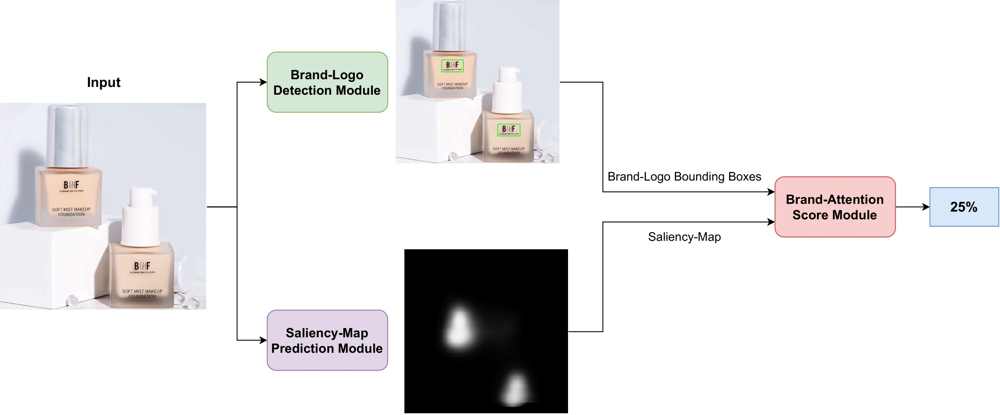
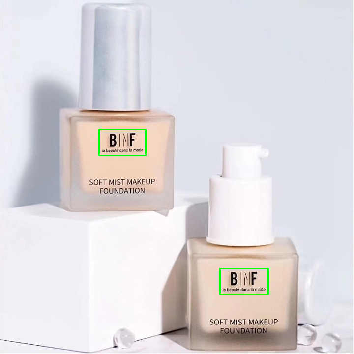
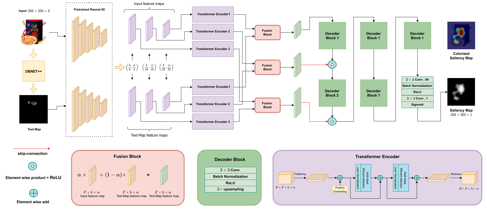
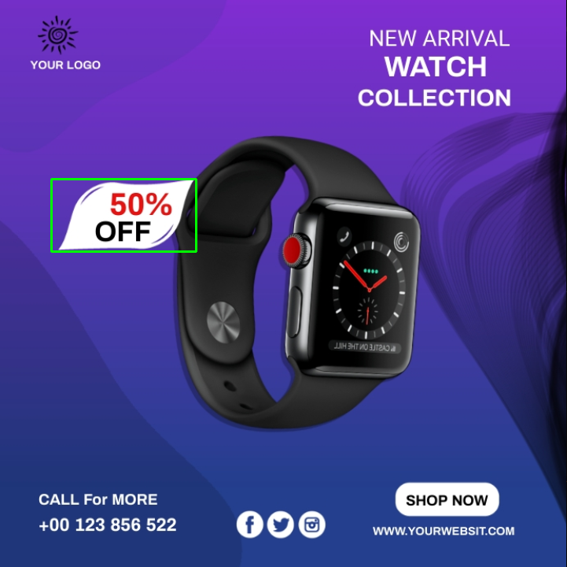

<br/>
<div align="center">
  <h1 style="font-size: 60px;">Brand Attention</h1>

  <p>
    This repo contains the official implementation for the paper: Brand Visibility in Packaging: A Deep Learning Approach for Logo Detection, Saliency-Map Prediction, and Logo Placement Analysis
    <br/><br/>
    <a href="http://arxiv.org/abs/2403.02336">Paper</a>
    .
    <a href="https://arhosseini77.github.io/BrandAttention_page">Project Page</a>
    .
    <a href="mailto:arhosseini77@ut.ac.ir">Dataset</a>
  </p>
</div>


<br/>
<div align="center">
   
   
   
   
  <a href="https://colab.research.google.com/drive/1jE0mY81mF8lO2Yh8bRo0p_J0HTeHcv6J?authuser=2#scrollTo=mcUVVkhUSXsj">
    
  </a>
</div>
<br/>


<div align="center">
    
</div>


## Installation

Install Pytorch with :
````
pip install torch==1.12.1+cu116 torchvision==0.13.1+cu116 torchaudio==0.12.1 --extra-index-url https://download.pytorch.org/whl/cu116
````
Install the requirements with:
```shell
pip install -r requirements.txt
```

Download weights:
````
mkdir weights
cd weights
gdown 1p6LyrHIAYbz5M94eBTTOcduWF-TzeQ1D # Logo-Detection-Yolov8
gdown 1_0iA_pmC4-IvA7IaRuiJ-QHnRheIEmBe  # ECT-SAL weights
cd ..
cd saliency_prediction
mkdir pretrained_models
cd pretrained_models
gdown 1C9TgPQvFQHJP3byDtBL5X56cXeOl4JE2  # Resnet 50 pretrained weight
cd ..
cd ..
````

## Brand-Logo Detection

### Description

This module focuses on detecting brand logos in images using the YOLOv8 model. 
It utilizes two datasets for training: [FoodLogoDet-1500](https://github.com/hq03/FoodLogoDet-1500-Dataset) and [LogoDet-3K](https://github.com/Wangjing1551/LogoDet-3K-Dataset).

### Inference

You can use the following command to run the brand logo detection code:

```shell
python main_detection_yolov8.py --model="weights/Logo_Detection_Yolov8.pt" --image="test_images/test.jpg" --save-result
```
* If you want to visualize the detection results, include the --save-result flag in the command.

### Result


|             Original Image                | Brand Logo Detection Result                          |
| ------------------------------------------------------ |-----------------------------------------|
|    ||


## ECT-SAL

<div align="center">
      
</div>


### Description

This module is designed for predicting saliency maps of images, particularly suited for use in ads and packaging. Model leverages the ECSAL dataset for training. You can find the dataset [here](https://github.com/leafy-lee/E-commercial-dataset).

### Inference

* For saliency map prediction, it is essential to provide a corresponding text map. Use the DBNET++ model available [here](text_detector_module/README.md) to generate accurate text maps for improved saliency predictions.

Run the script:
```bash
python main_saliency_prediction.py --img_path path/to/your/image.jpg --weight_path "weights/ECT_SAL.pth" --tmap path/to/test_text_map_image.jpg --output_path path/to/output/directory
```

### Training

To train your dataset on the ECT-SAL model, follow the instructions provided in the [ECT-SAL README](saliency_prediction/README.md).

### Result

|             Original Image                | Saliency Map                                  |
| ------------------------------------------------------ |-----------------------------------------------|
|  |  |


## Brand-Attention

The Brand Attention Module is a component designed to assess the visibility and attention of a brand within advertisement and packaging images. It combines logo detection and saliency map prediction techniques to quantify the presence and prominence of a brand in a given image.

### Inference

* For saliency map prediction, it is essential to provide a corresponding text map. Use the DBNET++ model available [here](text_detector_module/README.md) to generate accurate text maps for improved saliency predictions.

```bash
python main_brand_attention.py --img_path path/to/input_image.jpg --tmap path/to/text_map.jpg
```
 * If the detection is accurate and aligns with the brand logo, press  to confirm.

 * In cases where adjustments are needed or discrepancies exist, press  to signify the need for refinement.

 * For refinement, use the interactive feature to draw new bounding boxes (bboxes) directly on the image. This hands-on approach allows for precise customization of logo localization.

### Result 

|                  Input Image                  |
|:---------------------------------------------:|
|  | 
|         Brand-Attention Score: 23.54          |


## Advertisement image object Attention

This Module is a component designed to assess the visibility and attention of any object you want within advertisement and packaging images. It saliency map prediction techniques to quantify the presence and prominence of that object in a given image.

### Inference

* For saliency map prediction, it is essential to provide a corresponding text map. Use the DBNET++ model available [here](text_detector_module/README.md) to generate accurate text maps for improved saliency predictions.

```bash
python main_object_attention.py --img_path path/to/input_image.jpg --tmap path/to/text_map.jpg
```

* draw bounding boxes around objects of interest, press the **Enter** key to calculate and obtain the attention score for the selected objects.

### Result 

|                Input Image                | BBox Selected                                   |
|:-----------------------------------------:|:------------------------------------------------:|
|  |  |
|          Object Attention Score           | 11.22%                                          |


## Acknowledgement
We thank the authors of [Transalnet](https://github.com/LJOVO/TranSalNet), [DBNET](https://github.com/xuannianz/DifferentiableBinarization), [Efficient-Attention](https://github.com/cmsflash/efficient-attention) for their code repositories.


## Citation
```bibtex
@article{hosseini2024brand,
  title={Brand Visibility in Packaging: A Deep Learning Approach for Logo Detection, Saliency-Map Prediction, and Logo Placement Analysis},
  author={Hosseini, Alireza and Hooshanfar, Kiana and Omrani, Pouria and Toosi, Reza and Toosi, Ramin and Ebrahimian, Zahra and Akhaee, Mohammad Ali},
  journal={arXiv preprint arXiv:2403.02336},
  year={2024}
}
```
