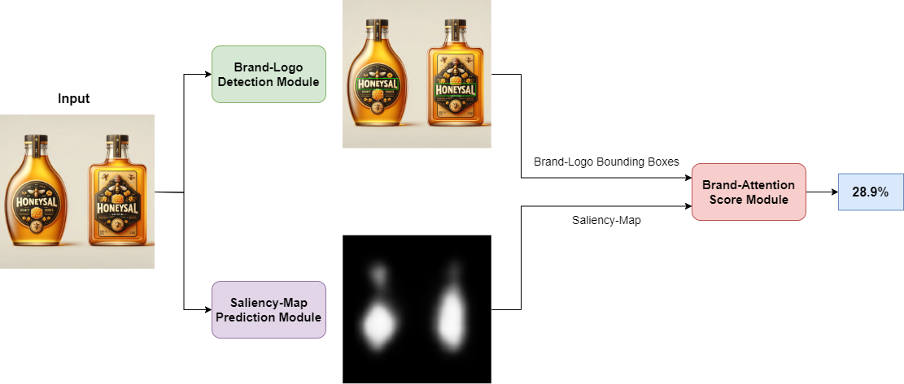

# Brand Attention
<a href="link later"></a>


## Installation

Install Pytorch with :
````
pip install torch==1.12.1+cu116 torchvision==0.13.1+cu116 torchaudio==0.12.1 --extra-index-url https://download.pytorch.org/whl/cu116
````
Install the requirements with:
```shell
pip install -r requirements.txt
```

## Brand-Logo Detection

### Description

This module focuses on detecting brand logos in images using the YOLOv8 model. It utilizes two datasets for training: [FoodLogoDet-1500](https://github.com/hq03/FoodLogoDet-1500-Dataset) and [LogoDet-3K](https://github.com/Wangjing1551/LogoDet-3K-Dataset).

Table Below Show Performance of YOLOv8 Fine-tuned Model.

#### Table1: Metrics on Models Fine-Tuned over Foodlogo-det-1500

| Method    | $mAP_{50}$ | $mAP_{50-95}$ | Precision | Recall |
|-----------|------------|---------------|-----------|--------|
| MFDNet    | 0.879      | 0.635         | 0.836     | 0.811  |
| YOLOv7    | 0.932      | 0.698         | 0.90      | 0.866  |
| YOLOv8    | **0.936**  | **0.704**     | **0.904** | **0.879** |

#### Table2: Metrics on Models Pretrained on FoodLogo and Fine-Tuned over FoodLogoDet-1500+LogoDet3k Dataset

| Method    | $mAP_{50}$ | $mAP_{50-95}$ | Precision | Recall |
|-----------|------------|---------------|-----------|--------|
| MFDNet    | 0.87       | 0.62          | 0.82      | 0.8    |
| YOLOv7    | 0.88       | 0.61          | 0.84      | 0.81   |
| YOLOv8    | **0.94**   | **0.71**      | **0.91**  | **0.88** |
### Inference

You can use the following command to run the brand logo detection code:

```shell
python main_detection_yolov8.py --model="weights/Logo_Detection_Yolov8.pt" --image="test_images/test.jpg" --save-result
```
* If you want to visualize the detection results, include the --save-result flag in the command.

### Result

|             Original Image                | Brand Logo Detection Result                          |
| ------------------------------------------------------ |-----------------------------------------|
|   ||


## ECT-SAL

### Description
This module is designed for predicting saliency maps of images, particularly suited for use in ads and packaging. Model leverages the ECSAL dataset for training. You can find the dataset [here](https://github.com/leafy-lee/E-commercial-dataset).

Table below show ECT-SAL Performance against SOTA methods. (Average,STDEV)

| Method               | CC &uarr;          | KL &darr;        | AUC &uarr;          | NSS &uarr;          | SIM &uarr;          |
|----------------------|--------------------|------------------|---------------------|---------------------|---------------------|
| Contextual Encoder-Decoder | 0.459, 0.136       | 1.13,0.23        | 0.76 , 0.066       | 0.925 , 0.268      | 0.373 , 0.06       |
| DeepGazeIIE           | 0.561 , 0.124    | 0.995 , 0.215    | 0.842 , 0.055         | 1.327 , 0.318         | 0.399 , 0.065         |
| UNISAL               | 0.6 , 0.15       | 0.768 , 0.262    | 0.845 , 0.056         | 1.574 , 0.522         | 0.514 , 0.094         |
| EML-Net              | 0.510 , 0.16     | 1.227 , 0.903    | 0.807 , 0.062        | 1.232 , 0.407        | 0.536 , 0.103        |
| VGGSAM               | 0.691 , 0.126    | 0.682 , 0.259    | 0.815 , 0.048         | 1.324 , 0.362         | 0.58 , 0.091         |
| Transalnet           | 0.717 , 0.061    | 0.873 , 0.079    | 0.824 , 0.054         | 1.723 , 0.203         | 0.534 , 0.043         |
| VGGSSM               | 0.728 , 0.121    | 0.599 , 0.237    | 0.829 , 0.043         | 1.396 , 0.359         | 0.611 , 0.089         |
| Temp-SAL             | 0.719 , 0.065    | 0.712 , 0.126    | 0.813 , 0.077         | 1.768 , 0.182         | 0.629 , 0.048         |
| SSwin transformer    | 0.687 , 0.175    | 0.652 , 0.478    | 0.868 , 0.072         | 1.701 , 0.497         | 0.606 , 0.101         |
| **Ours**             | **0.75 , 0.054** | **0.585 , 0.127** | **0.859 , 0.055**     | **1.912 , 0.212**     | **0.649 , 0.043**     |


### Inference
* For saliency map prediction, it is essential to provide a corresponding text map. We recommend using the DBNET++ model available [here](https://github.com/WenmuZhou/DBNet.pytorch) to generate accurate text maps for improved saliency predictions.
Run the script:
```bash
python main_saliency_prediction.py --img_path path/to/your/image.jpg --weight_path "weights/ECT_SAL.pth" --tmap path/to/test_text_map_image.jpg --output_path path/to/output/directory
```
### Result

## Brand-Attention
The Brand Attention Module is a component designed to assess the visibility and attention of a brand within advertisement and packaging images. It combines logo detection and saliency map prediction techniques to quantify the presence and prominence of a brand in a given image.
