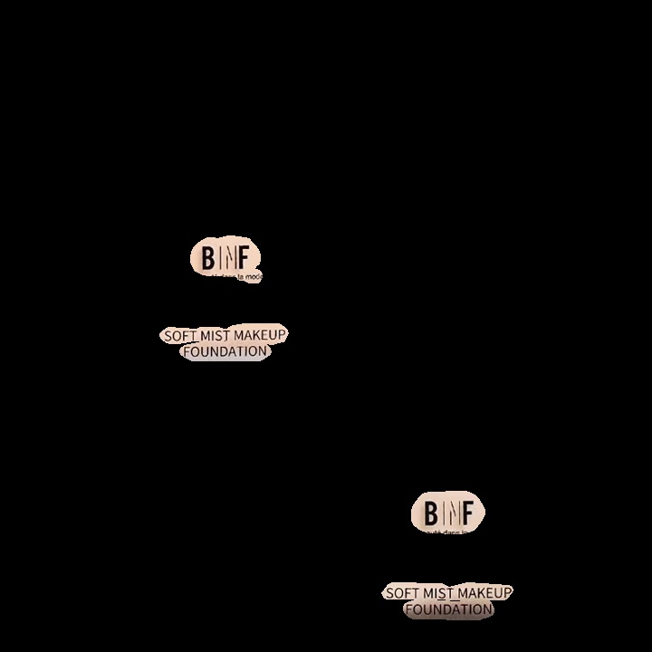

# Text-Detection Module

this module is based on [DBNET++](https://github.com/xuannianz/DifferentiableBinarization) Model 

Google colab notebook of text-detector module available here:

<a href="https://colab.research.google.com/drive/1AQZAabdWNalgDZjsYRKRfv2HOeGXWTKU?usp=sharing"></a>

## Quick Start

* Python 3.7
* install requirements

```python
pip install keras_resnet
pip install pyclipper
pip install opencv-python==3.4.2.17
pip install shapely
pip install tensorflow-gpu==1.14.0
pip install protobuf==3.20
pip install Keras==2.2.5
pip install h5py==2.10.0
```

* Download Weights
```python
gdown 1_vuZs6vEKl1VmwHUDdfP9ZRgL-C0t21I
```

* Inference
```python
python inference_textmap.py --input_dir ./path_to_input_dir --output_dir ./path_to_output_dir
```

## Result

| Original Image                      | Saliency Map                           |
|-------------------------------------|----------------------------------------|
|  |  |

